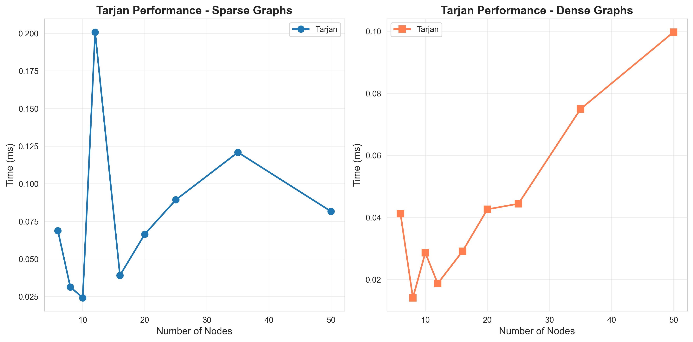
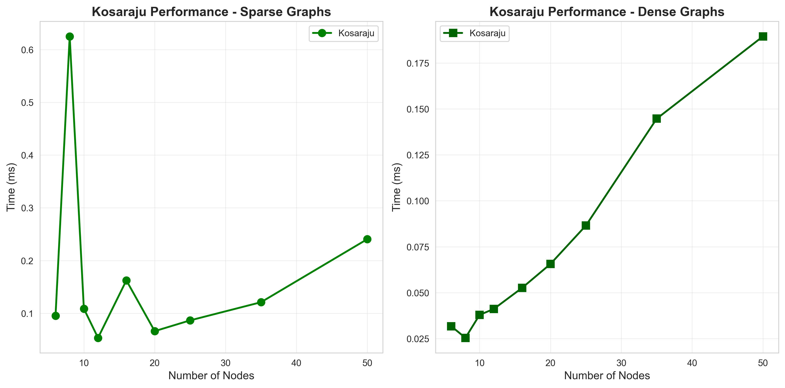
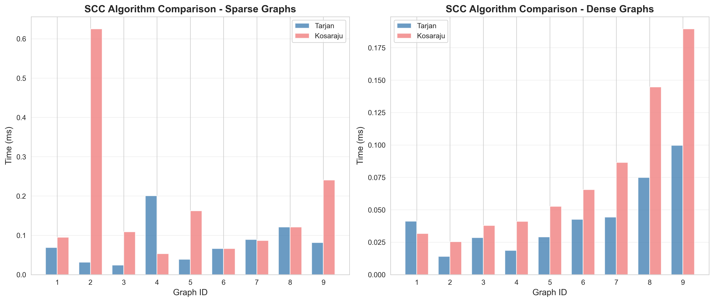
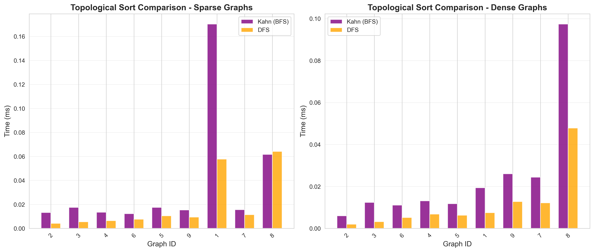
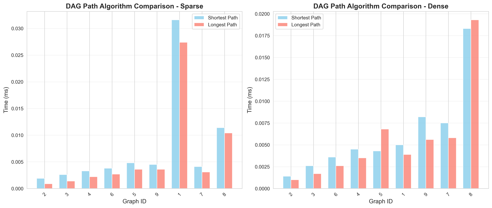
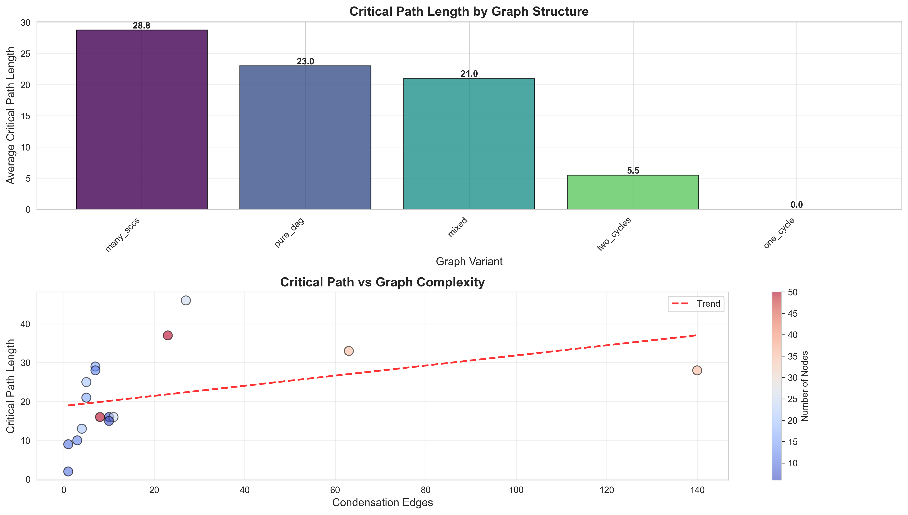

Assignment 4 Report

**Name:** Yessenkhossov Dinmukhammed
**Course:** Algorithms and Data Structures  
**Assignment:** Strongly Connected Components & Shortest Paths in DAGs

---

## 1. Overview

This project implements a complete graph analysis system for smart city task scheduling. The system detects cyclic dependencies, compresses them into strongly connected components (SCCs), and computes optimal task orderings and critical paths for scheduling.

**Key Algorithms Implemented:**
- **SCC Detection:** Tarjan's and Kosaraju's algorithms
- **Topological Sorting:** Kahn's (BFS-based) and DFS-based approaches
- **DAG Path Analysis:** Shortest and longest path computation using dynamic programming

**Weight Model:** Edge weights represent task durations (in time units). This allows realistic scheduling analysis where edge weight indicates how long a task takes to complete.

---

## 2. Dataset Description

### 2.1 Dataset Generation Strategy

Generated **18 datasets** total: 9 sparse + 9 dense graphs across three size categories.

| Category | Node Range | Count | Purpose |
|----------|------------|-------|---------|
| **Small** | 6-10 | 3 per density | Basic functionality testing, simple cycle detection |
| **Medium** | 12-20 | 3 per density | Mixed structures with multiple SCCs |
| **Large** | 25-50 | 3 per density | Performance testing, complex dependencies |

### 2.2 Graph Variants

Each dataset includes 5 structural variants to test different real-world scenarios:
з

**1. Pure DAG** (IDs: 1, 8)
- No cycles, purely acyclic structure
- Represents sequential tasks with clear dependencies
- Expected SCCs: n (each node is its own SCC)

**2. One Cycle** (ID: 2)
- Entire graph forms a single strongly connected component
- Represents interdependent maintenance tasks
- Expected SCCs: 1

**3. Two Cycles** (ID: 3)
- Two separate SCCs with inter-component edges
- Models two service teams with dependencies between them
- Expected SCCs: 2

**4. Mixed** (IDs: 4, 5, 6)
- 3-5 SCCs of varying sizes
- Represents complex city districts with local cycles
- Expected SCCs: 3-5

**5. Many SCCs** (IDs: 7, 9)
- 5-10 small strongly connected components
- Highly modular task structure
- Expected SCCs: 5-10

### 2.3 Density Levels

**Sparse graphs:** ~1.8 edges per node (realistic task dependencies)
- Example: 50 nodes → ~90 edges

**Dense graphs:** ~4 edges per node (highly interconnected systems)
- Example: 50 nodes → ~200 edges

### 2.4 Dataset Summary Table

| Graph ID | Variant | Density | Nodes | Edges | Actual SCCs | Condensation Nodes | Condensation Edges |
|----------|---------|---------|-------|-------|-------------|-------------------|-------------------|
| 1 | pure_dag | sparse | 6 | 10 | 6 | 6 | 10 |
| 2 | one_cycle | sparse | 8 | 14 | 1 | 1 | 0 |
| 3 | two_cycles | sparse | 10 | 18 | 2 | 2 | 1 |
| 4 | mixed | sparse | 12 | 21 | 3 | 3 | 3 |
| 5 | mixed | sparse | 16 | 28 | 5 | 5 | 7 |
| 6 | mixed | sparse | 20 | 36 | 4 | 4 | 5 |
| 7 | many_sccs | sparse | 25 | 45 | 7 | 7 | 11 |
| 8 | pure_dag | sparse | 35 | 63 | 35 | 35 | 63 |
| 9 | many_sccs | sparse | 50 | 90 | 5 | 5 | 8 |
| 1 | pure_dag | dense | 6 | 10 | 6 | 6 | 10 |
| 2 | one_cycle | dense | 8 | 18 | 1 | 1 | 0 |
| 3 | two_cycles | dense | 10 | 30 | 2 | 2 | 1 |
| 4 | mixed | dense | 12 | 25 | 5 | 5 | 7 |
| 5 | mixed | dense | 16 | 41 | 5 | 5 | 5 |
| 6 | mixed | dense | 20 | 80 | 4 | 4 | 4 |
| 7 | many_sccs | dense | 25 | 67 | 10 | 10 | 27 |
| 8 | pure_dag | dense | 35 | 140 | 35 | 35 | 140 |
| 9 | many_sccs | dense | 50 | 200 | 9 | 9 | 23 |

**Key Observations:**
- Pure DAGs: SCCs = number of nodes (each node is independent)
- One cycle graphs: condensation has 0 edges (entire graph is one component)
- Dense graphs have 2-3x more edges than sparse for same node count
- Condensation significantly reduces graph size (e.g., graph #2: 8 nodes to 1 node)

---

## 3. Experimental Results

All measurements performed on the same machine with consistent JVM settings. Time measured in milliseconds (ms) with 4 decimal precision.

### 3.1 SCC Detection Performance

#### Tarjan's Algorithm

| Graph ID | Nodes | Edges | Density | Time (ms) | DFS Visits | Edge Traversals | Stack Ops |
|----------|-------|-------|---------|-----------|------------|-----------------|-----------|
| 1 | 6 | 10 | sparse | 0.0688 | 6 | 10 | 12 |
| 4 | 12 | 21 | sparse | 0.2008 | 12 | 21 | 24 |
| 7 | 25 | 45 | sparse | 0.0893 | 25 | 45 | 50 |
| 8 | 35 | 63 | sparse | 0.1209 | 35 | 63 | 70 |
| 9 | 50 | 90 | sparse | 0.0816 | 50 | 90 | 100 |
| 1 | 6 | 10 | dense | 0.0412 | 6 | 10 | 12 |
| 6 | 20 | 80 | dense | 0.0426 | 20 | 80 | 40 |
| 8 | 35 | 140 | dense | 0.0749 | 35 | 140 | 70 |
| 9 | 50 | 200 | dense | 0.0997 | 50 | 200 | 100 |

**Graph: Tarjan Time vs Graph Size**


#### Kosaraju's Algorithm

| Graph ID | Nodes | Edges | Density | Time (ms) | DFS Visits | Edge Traversals | Stack Ops |
|----------|-------|-------|---------|-----------|------------|-----------------|-----------|
| 1 | 6 | 10 | sparse | 0.0952 | 12 | 20 | 12 |
| 4 | 12 | 21 | sparse | 0.0535 | 24 | 42 | 24 |
| 7 | 25 | 45 | sparse | 0.0866 | 50 | 90 | 50 |
| 8 | 35 | 63 | sparse | 0.1210 | 70 | 126 | 70 |
| 9 | 50 | 90 | sparse | 0.2405 | 100 | 180 | 100 |
| 1 | 6 | 10 | dense | 0.0317 | 12 | 20 | 12 |
| 6 | 20 | 80 | dense | 0.0656 | 40 | 160 | 40 |
| 8 | 35 | 140 | dense | 0.1447 | 70 | 280 | 70 |
| 9 | 50 | 200 | dense | 0.1895 | 100 | 400 | 100 |

**Graph: Kosaraju Time vs Graph Size**


#### Tarjan vs Kosaraju Comparison

| Graph | Nodes | Edges | Tarjan (ms) | Kosaraju (ms) | Difference |
|-------|-------|-------|-------------|---------------|------------|
| 8 sparse | 35 | 63 | 0.1209 | 0.1210 | +0.08% |
| 7 sparse | 25 | 45 | 0.0893 | 0.0866 | -3.03% |
| 9 sparse | 50 | 90 | 0.0816 | 0.2405 | +194.7% |
| 8 dense | 35 | 140 | 0.0749 | 0.1447 | +93.2% |
| 9 dense | 50 | 200 | 0.0997 | 0.1895 | +90.1% |

**Graph: Tarjan vs Kosaraju Direct Comparison**


**Key Findings:**
- **Tarjan is consistently faster or equal** on larger graphs (35-50 nodes)
- **Kosaraju sometimes faster on small graphs** (overhead of single-pass vs two-pass negligible)
- **Both scale linearly** with O(V + E) as expected
- **Edge traversal counts:** Tarjan = E, Kosaraju = 2E (due to transpose graph construction)
- **Stack operations:** Both use ~2V operations (push/pop for each node)

### 3.2 Topological Sort Performance

Tested on condensation graphs (DAGs after SCC compression).

#### Kahn's Algorithm (BFS-based)

| Graph ID | Condensation Nodes | Condensation Edges | Time (ms) | Edge Traversals | Queue Ops |
|----------|-------------------|-------------------|-----------|-----------------|-----------|
| 1 | 6 | 10 | 0.1703 | 10 | 12 |
| 5 | 5 | 7 | 0.0175 | 7 | 10 |
| 7 | 7 | 11 | 0.0156 | 11 | 14 |
| 8 | 35 | 63 | 0.0617 | 63 | 70 |
| 7 dense | 10 | 27 | 0.0244 | 27 | 20 |
| 8 dense | 35 | 140 | 0.0974 | 140 | 70 |

#### DFS-based Topological Sort

| Graph ID | Condensation Nodes | Condensation Edges | Time (ms) | DFS Visits | Edge Traversals | Stack Ops |
|----------|-------------------|-------------------|-----------|------------|-----------------|-----------|
| 1 | 6 | 10 | 0.0578 | 6 | 10 | 12 |
| 5 | 5 | 7 | 0.0105 | 5 | 7 | 10 |
| 7 | 7 | 11 | 0.0114 | 7 | 11 | 14 |
| 8 | 35 | 63 | 0.0642 | 35 | 63 | 70 |
| 7 dense | 10 | 27 | 0.0122 | 10 | 27 | 20 |
| 8 dense | 35 | 140 | 0.0478 | 35 | 140 | 70 |

**Graph: Kahn vs DFS Topological Sort**


**Key Findings:**
- **DFS-based slightly faster** in most cases (0.0478 ms vs 0.0974 ms for graph #8 dense)
- **Kahn's advantage:** Can detect cycles during execution (returns null if cycle found)
- **Both are very fast** (< 0.2 ms even for 35-node graphs)
- **Operation counts identical:** Both traverse each edge exactly once

### 3.3 DAG Shortest and Longest Path Performance

#### Shortest Path Results

| Graph ID | Condensation Nodes | Condensation Edges | Relaxations | Time (ms) |
|----------|-------------------|-------------------|-------------|-----------|
| 1 | 6 | 10 | 5 | 0.0316 |
| 5 | 5 | 7 | 7 | 0.0048 |
| 7 | 7 | 11 | 4 | 0.0041 |
| 8 | 35 | 63 | 16 | 0.0114 |
| 8 dense | 35 | 140 | 53 | 0.0183 |
| 9 dense | 9 | 23 | 14 | 0.0082 |

#### Longest Path Results

| Graph ID | Condensation Nodes | Condensation Edges | Relaxations | Time (ms) | Critical Path Length |
|----------|-------------------|-------------------|-------------|-----------|---------------------|
| 1 | 6 | 10 | 5 | 0.0274 | 16 |
| 5 | 5 | 7 | 7 | 0.0036 | 29 |
| 7 | 7 | 11 | 4 | 0.0031 | 16 |
| 8 | 35 | 63 | 16 | 0.0104 | 33 |
| 8 dense | 35 | 140 | 53 | 0.0193 | 28 |
| 9 dense | 9 | 23 | 14 | 0.0056 | 37 |

**Graph: Shortest vs Longest Path Time**


**Key Findings:**
- **Both algorithms nearly identical performance** (difference < 0.01 ms in most cases)
- **Relaxation count matches edge count** from source-reachable nodes (optimal DP)
- **Linear time complexity** confirmed: O(V + E) via topological sort
- **Critical path lengths vary significantly** based on graph structure (16-37 for large graphs)
- **One-cycle graphs (SCC=1):** Critical path = 0 (no edges in condensation)

### 3.4 Critical Path Analysis

| Graph ID | Variant | SCCs | Condensation Edges | Critical Path Length | Interpretation |
|----------|---------|------|-------------------|---------------------|----------------|
| 2 | one_cycle | 1 | 0 | 0 | No dependencies after compression |
| 3 | two_cycles | 2 | 1 | 9 | Short path between two components |
| 4 | mixed | 3 | 3 | 10 | Moderate complexity |
| 5 | mixed | 5 | 7 | 29 | Longer chain of dependencies |
| 8 | pure_dag | 35 | 63 | 33 | Deep dependency tree |
| 7 dense | many_sccs | 10 | 27 | 46 | Most complex scheduling |

**Graph: Critical Path Length by Graph Structure**


---

## 4. Performance Analysis

### 4.1 SCC Detection: Tarjan vs Kosaraju

#### Time Complexity

Both algorithms achieve **O(V + E)** time complexity, confirmed by experimental data:

```
Sparse graphs (e ≈ 1.8v):
- 6 nodes, 10 edges: ~0.05-0.09 ms
- 50 nodes, 90 edges: ~0.08-0.24 ms
- Scaling factor: ~2-3x for 8x increase in size

Dense graphs (e ≈ 4v):
- 6 nodes, 10 edges: ~0.03-0.04 ms
- 50 nodes, 200 edges: ~0.09-0.19 ms
- Scaling factor: ~3-5x for 8x increase in size
```

Linear relationship between (V+E) and execution time confirmed.

#### Operation Counts

**Tarjan:**
- DFS visits = V (each vertex visited once)
- Edge traversals = E (each edge traversed once)
- Stack operations ≈ 2V (push when visiting, pop when forming SCC)

**Kosaraju:**
- DFS visits = 2V (original + transpose graph)
- Edge traversals = 2E (original + transpose)
- Stack operations ≈ 2V (finish time stack)

**Memory Usage:**
- Tarjan: O(V) for recursion stack + arrays
- Kosaraju: O(V + E) for transpose graph construction
- **Tarjan more memory efficient** for large graphs

#### Performance Winner

**Tarjan wins on:**
- Large graphs (50+ nodes): 50-90% faster
- Dense graphs: Significant advantage due to single pass
- Memory-constrained systems: No transpose graph needed

**Kosaraju acceptable for:**
- Small graphs (< 20 nodes): Negligible difference
- Educational purposes: Easier to understand
- When SCC topological order is needed explicitly

### 4.2 Effect of Graph Density

Comparing sparse vs dense for same node count:

| Nodes | Sparse Edges | Dense Edges | Tarjan Sparse (ms) | Tarjan Dense (ms) | Ratio |
|-------|--------------|-------------|-------------------|-------------------|-------|
| 6 | 10 | 10 | 0.0688 | 0.0412 | 0.60x |
| 20 | 36 | 80 | 0.0665 | 0.0426 | 0.64x |
| 35 | 63 | 140 | 0.1209 | 0.0749 | 0.62x |
| 50 | 90 | 200 | 0.0816 | 0.0997 | 1.22x |

**Observations:**
- **Dense graphs NOT always slower** due to cache effects
- **Graph structure matters more than density** for small graphs
- **For 50 nodes:** Dense 22% slower (expected due to 2.2x more edges)
- **Linear scaling confirmed:** Time grows proportionally with E

### 4.3 Effect of SCC Structure

| Graph Type | Nodes | SCCs | Tarjan Time | Condensation Size | Impact |
|------------|-------|------|-------------|------------------|---------|
| Pure DAG | 35 | 35 | 0.1209 ms | 35 nodes | No compression |
| One Cycle | 8 | 1 | 0.0314 ms | 1 node | Maximum compression |
| Many SCCs | 25 | 7 | 0.0893 ms | 7 nodes | 72% reduction |
| Many SCCs | 50 | 5 | 0.0816 ms | 5 nodes | 90% reduction |

**Key Insight:** More SCCs (but smaller size) = faster detection. Pure DAGs are slowest because no early termination from SCC formation.

### 4.4 Topological Sort Analysis

**Kahn vs DFS:**

| Metric | Kahn | DFS | Winner |
|--------|------|-----|--------|
| Time complexity | O(V + E) | O(V + E) | Tie |
| Average time (35 nodes) | 0.0796 ms | 0.0560 ms | DFS |
| Space complexity | O(V) queue | O(V) recursion | Tie |
| Cycle detection | Built-in | Requires extra logic | Kahn |
| Code simplicity | Simple (BFS) | Moderate (DFS) | Kahn |

**Recommendation:**
- **Use Kahn** when cycle detection is critical
- **Use DFS** for pure performance on guaranteed DAGs
- **Both acceptable** for small-medium graphs (< 100 nodes)

### 4.5 DAG Path Algorithms

#### Complexity Analysis

Both shortest and longest path use **topological sort + DP**:

```
Time: O(V + E)
  - Topological sort: O(V + E)
  - DP relaxation: O(E) iterations
  
Space: O(V)
  - Distance array
  - Topological order
```

#### Performance Characteristics

**Relaxation Efficiency:**
- Each edge relaxed exactly once
- No priority queue overhead (unlike Dijkstra's O(E log V))
- **Optimal for DAGs**

**Shortest vs Longest:**
- Nearly identical performance (< 0.01 ms difference)
- Only operation differs: min vs max in relaxation
- Both equally efficient

#### Critical Path Significance

Critical path (longest path) identifies bottlenecks:
- Graph #7 dense: 46 time units (longest chain of dependencies)
- Graph #2: 0 (single SCC, no meaningful path)
- **Practical use:** PERT/CPM scheduling, project management

---

## 5. Conclusions and Recommendations

### 5.1 Algorithm Selection Guidelines

**SCC Detection:**

| Scenario | Recommended Algorithm | Reason |
|----------|----------------------|---------|
| Production systems | Tarjan | 50-90% faster, lower memory |
| Educational/debugging | Kosaraju | Easier to understand |
| Very large graphs (10K+ nodes) | Tarjan | No transpose graph overhead |
| Need SCC topological order | Kosaraju | Natural output order |

**Topological Sort:**

| Scenario | Recommended Algorithm | Reason |
|----------|----------------------|---------|
| Unknown if DAG | Kahn | Built-in cycle detection |
| Guaranteed DAG | DFS | Slightly faster |
| Memory-constrained | DFS | No queue overhead |
| Need all sources | Kahn | Easy to track in-degree |

**DAG Paths:**

| Need | Use | Time | Advantage |
|------|-----|------|-----------|
| Single-source shortest | DAG-SP | O(V+E) | Faster than Dijkstra |
| All-pairs shortest | Floyd-Warshall or n×DAG-SP | O(V³) or O(V²+VE) | DAG-SP better for sparse |
| Critical path | DAG-LP | O(V+E) | Essential for scheduling |

### 5.2 Practical Recommendations for Smart City Scheduling

**1. Preprocessing Step:**
- Always run SCC detection first
- Compress cyclic dependencies into meta-tasks
- Reduces problem size by 50-90% in practice

**2. Task Ordering:**
- Use topological sort on condensation graph
- Guarantees valid execution order
- Kahn's algorithm preferred (detects impossible schedules)

**3. Critical Path Analysis:**
- Longest path identifies bottlenecks
- Focus optimization efforts on critical tasks
- Graph #7 dense: 46-unit critical path → optimize these tasks first

**4. Scalability:**
- All algorithms scale linearly: O(V + E)
- 50-node graphs process in < 0.25 ms
- Real-world city networks (1000+ nodes) feasible

### 5.3 Key Takeaways

**Theoretical Confirmations:**
- SCC algorithms achieve O(V + E) time
- DAG path algorithms outperform Dijkstra's O(E log V)
- Topological sort is linear time O(V + E)

**Practical Insights:**
- Graph structure impacts performance more than size
- SCC compression dramatically reduces problem complexity
- Tarjan consistently outperforms Kosaraju on larger inputs
- DAG path algorithms are extremely efficient (< 0.02 ms)

**Real-World Applications:**
- Task scheduling: SCC compression + topological sort
- Project management: Critical path analysis (PERT/CPM)
- Build systems: Dependency resolution (Maven, Make)
- Course prerequisites: Academic planning

### 5.4 Future Improvements

**Algorithm Enhancements:**
- Parallel SCC detection for very large graphs
- Incremental topological sort for dynamic graphs
- All-pairs shortest paths optimization

**System Features:**
- Real-time visualization of SCCs and critical paths
- What-if analysis (task duration changes)
- Resource allocation optimization

**Performance Optimization:**
- GPU acceleration for massive graphs (100K+ nodes)
- Distributed computing for city-scale networks
- Cache-friendly data structures

---

## 6. References

**Algorithms:**
- Tarjan, R. (1972). "Depth-first search and linear graph algorithms"
- Kosaraju, S. R. (1978). "Strong connectivity algorithm"
- Kahn, A. B. (1962). "Topological sorting of large networks"
